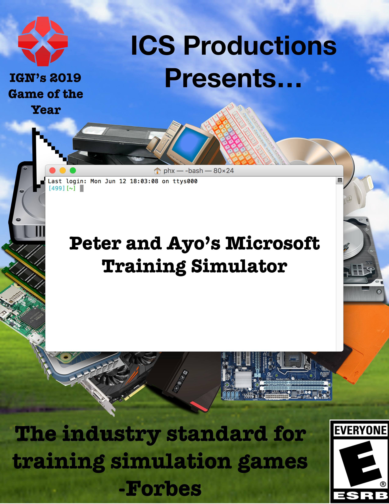
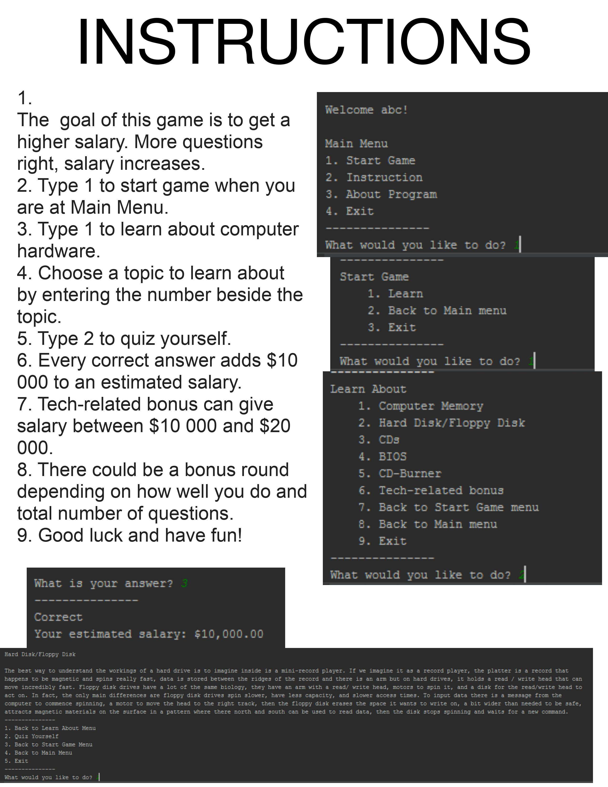

# ICS-Final
"Peter and Ayo's Microsoft Training Simulator" was created for my Grade 11 ICS Final. We aimed to teach potential users about computer hardware, making use of flow control and user input. Feel free to read our user manual to find out more about the project, including example questions.

